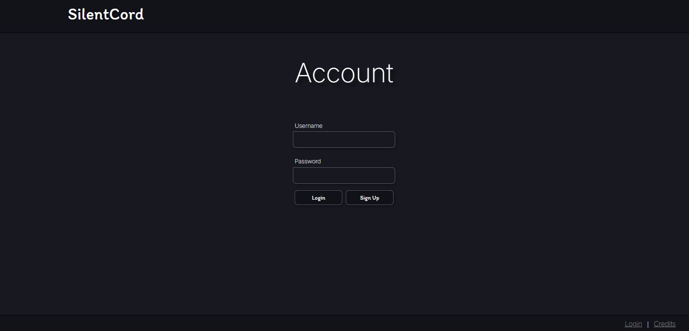
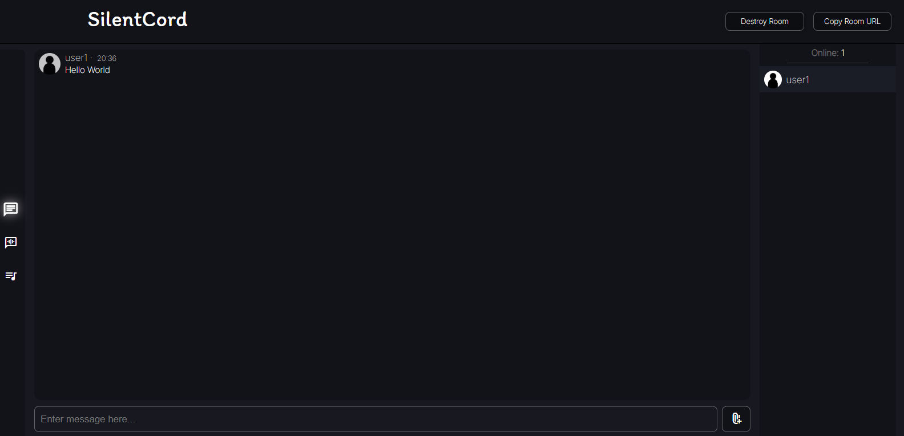

# **SilentCord**
<div>
    
    
    
    
    
    
</div>
<br>

A [Discord](https://discord.com/) inspired small and simple web-app to chat with people on a local area network with a room-based system.<br>
Built with NodeJS, TypeScript (ExpressJS, WebSockets) & Vanilla HTML / CSS.<br>
Uses [bcrypt](https://www.npmjs.com/package/bcrypt) to securely store user passwords.

## Preview Screnshots

> **Login Page**


> **Landing Page**


> **Chat room**



# Demo App
There is a [demo version of the app](https://silentcord.onrender.com/) hosted on [render.com.](https://render.com)<br>
It has signups closed and the following accounts can be used instead: <br>
```
-----------------------
USERNAME  |  PASSWORD |
-----------------------
 admin    |   admin   |
 user1    |   user    |
 user2    |   user    |
 user3    |   user    |
 user4    |   user    |
 user5    |   user    |
-----------------------
```

# Contributing

## TODO
- Ratelimits to prevent DDOS / DOS
- Attachments
- Voice Chat

## Guide
- Feature requests can be made by opening a new issue.
- If you are working on something, make a new issue with proper description and title describing what you are working on (new feature, bug fix etc.).
- If you are looking for stuff to contribute in, check out the Issues Tab and the todo list.
- Ensure your issue isn't a duplicate of an already existing issue.
- If working on something mentioned in the todo list, after creating the issue add your issue's URL as a hyperlink in front of the todo list item and remove the list item in your final PR before closing the issue. e.g.
    - Todo item 1 - [#00](https://example.com)
- Make sure you communiate with the other contributors if working on the same issue to save time and prevent duplicate work.

## Local Development Setup

- Ensure you have Node.js and npm installed.
- Clone this repo, cd into project's root directory.
- Install all dependencies:<br>
    ```bash
    npm i
    ```
- Create the `.env` file at the root of the project
    - Sample .env file:
        ```
        SECRET_ENCRPYTION_KEY = "7"
        IS_DEMO_WEB = "0"
        ``` 

- Start Application server:
    ```bash
    npm start
    ```
    > This command cleans the access tokens & previously built code, runs the typescript build command & hosts the server.

- Specific commmands:
    - ```bash
        npm run clean
        ```
        > Clean the access tokens, previously built code in /dist and other temp files if any.    

    - ```bash
        npm run build
        ``` 
        > Runs the typescript build command

### [View Server Docs](./DOCS.md)

## Project structure
```
silentcord/
├── .gitignore
├── demo_files/...
├── demo_imgs/...
├── package.json
├── README.md
├── src/ (main backend code)
│   ├── config.ts
│   ├── loggerpatch.ts
│   ├── main.ts
│   └── modules/
│       ├── accounts.ts
│       ├── messages.ts
│       ├── ratelimiter.ts
│       ├── room.ts
│       └── store.ts
├── static/ (static frontent code)
│   ├── assets/
│   │   ├── alert.css
│   │   ├── fonts/..
│   │   ├── img/..
│   │   ├── landing.css
│   │   ├── login.css
│   │   ├── room.css
│   │   └── shared.css
│   ├── credits.html
│   ├── credits.md
│   ├── index.html
│   ├── js/
│   │   ├── alert.js
│   │   ├── configs/
│   │   │   ├── events.json
│   │   │   └── messageConfig.json
│   │   ├── cssSwitcher.js
│   │   ├── landingPage.js
│   │   ├── libs/
│   │   │   └── marked.umd.js
│   │   ├── login.js
│   │   └── room.js
│   ├── login.html
│   └── room.html
└── tsconfig.json
```

# Credits
[Click here to view Credits](./static/credits.md)