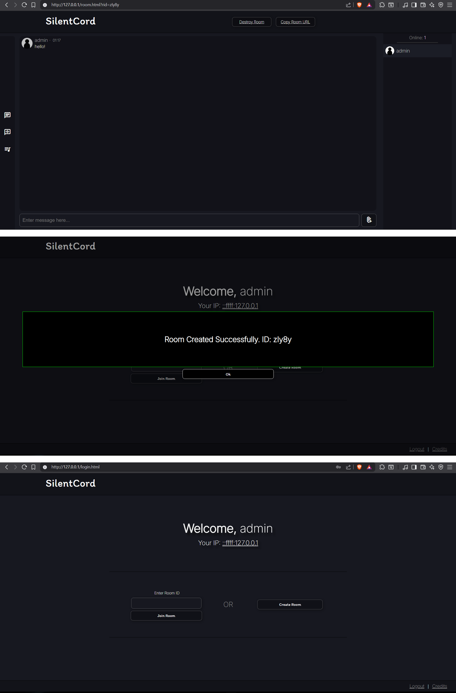

# SilentCord
A Discord inspired small and simple web-app to chat with people on a local area network with a room-based system.<br>
Built with NodeJS, TypeScript (ExpressJS, WebSockets) & Vanilla HTML / CSS.<br>
Uses bcrypt to securely store user passwords.<br><br>
[*View Credits*](./static/credits.md)

## Preview

> 

## TODO
- ~~Basic text chat~~
- ~~Password encryption with the bcrypt module~~
- ~~Make the room password work~~
- ~~Database integration with MySQL ([mysql2](https://www.npmjs.com/package/mysql2))~~ (DROPPED) Makes hosting locally inconvenient
- Ratelimits to prevent DDOS / DOS
- Attachments: Progress: Backend done
- Voice Chat
- Music-bot like channel

## Developing
- Install all dependencies
    - ```npm i```
- Start Application server
    - ```npm start``` > This command cleans the access tokens & previously build code, runs the typescript build command & hosts the server.
    - Specific commmands:
        - ```npm run clean``` > Clean the access tokens, previously build code in /dist and other temp files if any.
        - ```npm run build``` > Runs the typescript build command